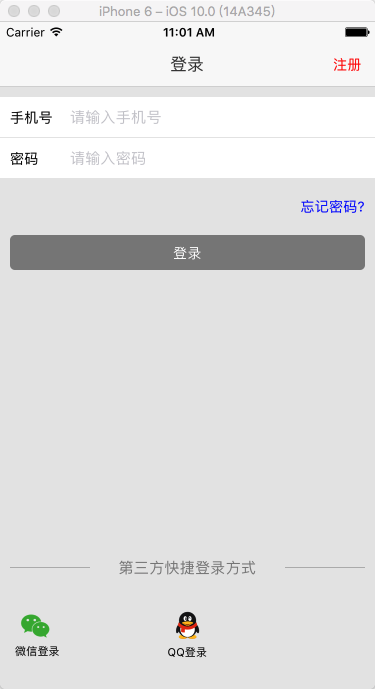
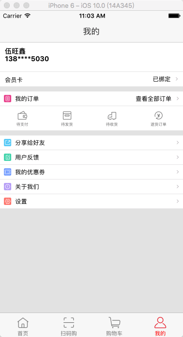

# 卜蜂莲花客户端的 React-native版
目前仅基于iOS版进行开发，可能还不适配安卓端

# 本程序相关接口都是基于原程序进行抓包完成
对源程序的仿真度几乎百分百

## How to run

1. Prepare your environment
2. Clone this repo, and goto the project root directory
3. run `npm install --save`
4. run `react-native run-ios`
5. Enjoy

## How does it look like?

* The login page

* The home page

* The content page

模拟器截图，可能图片像素不高

## 目前仍然在开发中
希望各位客官给点star动心继续开发
